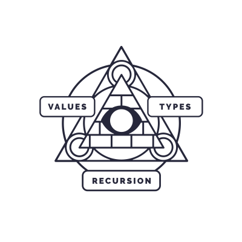

# Haskell MOOC

These are my solutions to the University of Helsinki Haskell Mooc course.

<p align="center"></p>

## Exercises

Exercises can be found under `exercises/` directory. All required dependencies
can be downloaded and built with:

```
stack build
```

Exercises are Haskell source code files named `Set1.hs`, `Set2.hs` and so on.